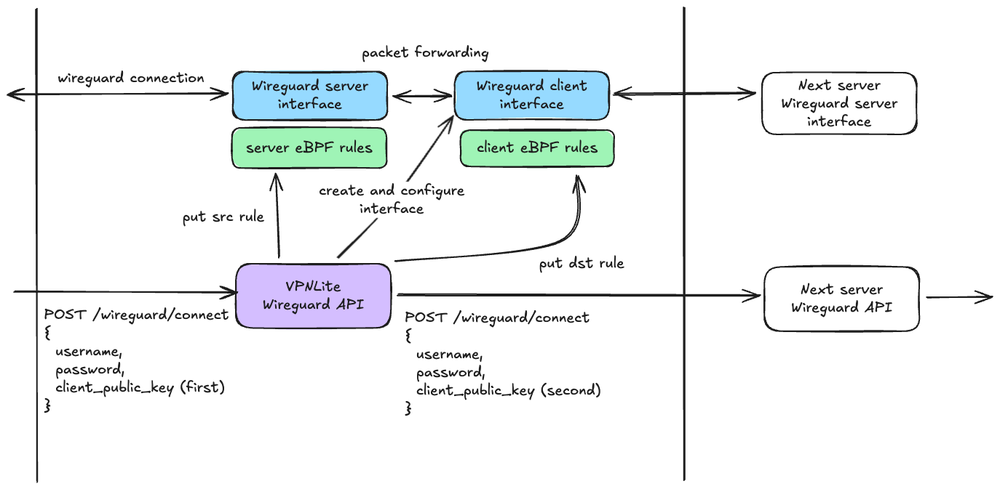
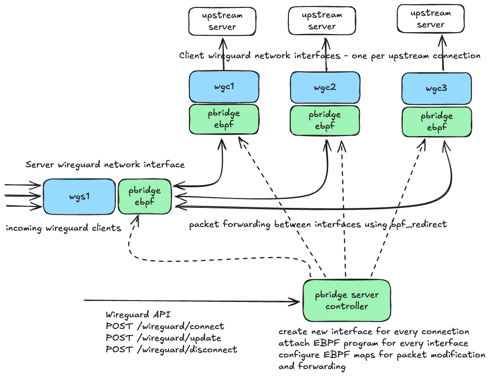

# Personal bridge

Personal Bridge is an open-source implementation of a WireGuard bridge server, designed for simplicity and ease of use. It enables seamless setup of multi-hop WireGuard connections, providing enhanced privacy and security for your network.

API Forwarding:


Traffic handling:


## Features

* WireGuard Bridge Server: Set up WireGuard multi-hop connections with ease.
* Simple Configuration: Easy-to-understand YAML configuration file for seamless setup.
* Admin Panel: Built-in API for managing server settings and client access.
* Automatic Key Generation: Automatically generates necessary WireGuard private keys.
* Session Management: Persist active session data for convenience and reliability.

## Requirements

* Linux Kernel 5.6 or newer with WireGuard and eBPF support
* Or Linux Kernel 3.19 - 5.5 with WireGuard compat module
* Domain name for TLS certificates (optional)

Tested on Ubuntu 20.04 LTS.

## Build

Build requires `make` and `docker` to be installed on the system.
Docker is used to build eBPF programs.
To build the project run the following command:

```bash
make build
```

Single static binary `pbridge` will be created.

## Configuration

The server is configured using a YAML configuration file.
The configuration file should have the following structure:

```yaml
# config example
logging:
  level: debug # debug, info, warn, error
  format: text # text, json
api:
  server_name: "server-name"
  admins: # credentials for admin panel
    - username: admin
      password: password
  # configuration for Wireguard API server
  # by default all clients allowed to connect
  clients: []
  # filesystem path to store active sessions
  session_storage: ./sessions
  # Wireguard API server listen address and TLS configuration
  listen:
    - addr: ":443"
      tls:
        acme:
          cache_dir: ./acme
          domains: ["server-name.example.com"]

wireguard:
  # configuration for wireguard server
  server:
    listen_port: 51820
    # subnet for wireguard clients, if subnet6 is not specified, only IPv4 will work
    subnet4: 10.234.0.0/16
    subnet6: fd00:0:1:2::/64
    # new private key will be automatically generated and saved if file does not exist
    private_key_file: ./wireguard/server.key
  client: {}
```

## Running the Server

To start the server locally, use the following command:


```bash
$ pbridge start --config config.yaml
```

# Contributing

At this time, we are not accepting new contributions to Personal Bridge. However, we appreciate your interest in the project! 

If you have any bug reports or feature suggestions, you're welcome to open an issue, and we will consider them for future updates.
